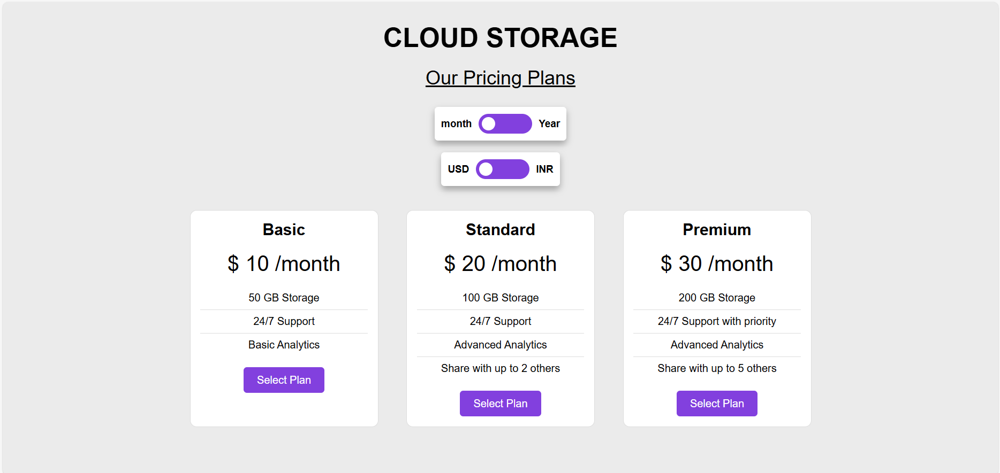

# Pricing Page
## Dive into the project
<em>(Tap on Pricing tag icon to view the project)</em>

## Overview:
A modern and interactive pricing page for a cloud storage service, built with HTML, CSS, and JavaScript. The page features three distinct plans: Basic, Standard, and Premium, and includes toggles for switching between monthly and yearly billing cycles, as well as between USD and INR currency.

## Features:
- **Three Pricing Plans:** Detailed features for Basic, Standard, and Premium plans.
- **Billing Cycle Toggle:** Switch between monthly and yearly billing options.
- **Currency Toggle:** Switch between USD and INR currencies.
- **Responsive Design:** Ensures compatibility across various devices and screen sizes.
- **Smooth Transitions:** Enhanced user experience with animations and transitions.

## Technologies Used:
- **HTML:** For structuring the pricing page and its elements.
- **CSS:** For styling the page layout, colors, and responsiveness.
- **JavaScript:** For adding interactivity, such as toggles and dynamic updates.
  <pre>
  </pre>

## Learnings:
Through the Pricing Page project, I gained valuable insights into various aspects of web development:

- **HTML Structure:** Designing the pricing table and layout using HTML taught me about structuring elements and creating interactive components.
- **CSS Styling:** Applying styles to create a visually appealing and responsive design helped me understand the power of CSS in web development.
- **JavaScript Interactivity:** Implementing dynamic behavior for toggles and updating content based on user interactions enhanced my skills in JavaScript and DOM manipulation.
  
## Contribution:
Contributions to the project are welcome! Feel free to fork the repository, make improvements, and submit pull requests to suggest new features or enhancements.

## License:
This project is open-source under the [MIT License](LICENSE), allowing for collaboration and distribution.
